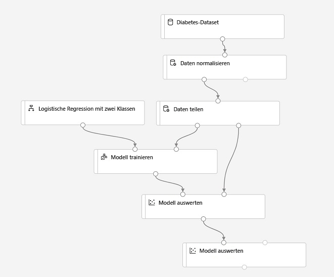
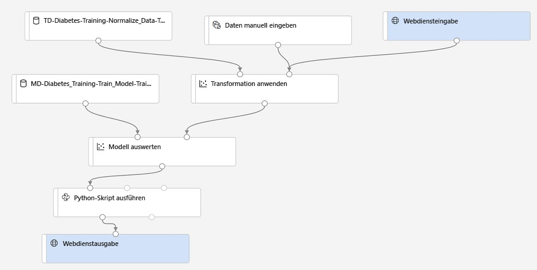

---
lab:
  title: Verwenden des Azure Machine Learning-Designers
ms.openlocfilehash: d9ebd39449d17d36b9b9e4ad2d2d43c4b866a305
ms.sourcegitcommit: 18f734eeb1031a9cb69c3b294632efd2e69324ac
ms.translationtype: HT
ms.contentlocale: de-DE
ms.lasthandoff: 11/17/2021
ms.locfileid: "132832611"
---
# <a name="use-azure-machine-learning-designer"></a>Verwenden des Azure Machine Learning-Designers

Der Azure Machine Learning-*Designer* bietet eine Drag & Drop-Umgebung, in der Sie einen Workflow oder eine *Pipeline* für ein Modul zur Dateneingabe, Transformation oder das Modelltraining definieren können, um ein Machine Learning-Modell zu erstellen. Sie können diese Pipeline dann als Webdienst veröffentlichen, den Clientanwendungen für *Rückschlüsse* (das Generieren von Prognosen anhand neuer Daten) nutzen können.

## <a name="before-you-start"></a>Vorbereitungen

Sofern nicht bereits geschehen, bearbeiten Sie die Übung *[Erstellen eines Azure Machine Learning-Arbeitsbereichs](01-create-a-workspace.md)* , um einen Azure Machine Learning-Arbeitsbereich und eine Compute-Instanz zu erstellen und die für diese Übung benötigten Notebooks zu klonen.

## <a name="configure-compute-resources"></a>Konfigurieren von Computeressourcen

Um den Azure Machine Learning-Designer verwenden zu können, benötigen Sie eine Computeressource, auf der Sie das Experiment zum Modelltraining durchführen.

1. Melden Sie sich mit den Ihrem Azure-Abonnement zugeordneten Microsoft-Anmeldedaten bei [Azure Machine Learning Studio](https://ml.azure.com?azure-portal=true) an, und wählen Sie Ihren Azure Machine Learning-Arbeitsbereich aus.
2. Zeigen Sie in Azure Machine Learning Studio die Seite **Compute** an, und starten Sie auf der Registerkarte **Compute-Instanzen** Ihre Compute-Instanz, falls diese noch nicht ausgeführt wird. Sie verwenden diese Compute-Instanz, um Ihr trainiertes Modell zu testen.
3. Wechseln Sie während des Starts der Compute-Instanz zur Registerkarte **Computecluster**. Falls Sie noch keinen Computecluster besitzen, fügen Sie einen neuen Computecluster mit den folgenden Einstellungen hinzu. Sie verwenden diesen Cluster, um die Trainingspipeline auszuführen.
    - **Region**: *Dieselbe Region, die auch Ihr Arbeitsbereich verwendet.*
    - **VM-Priorität:** Dediziert
    - **VM-Typ:** CPU
    - **VM-Größe:** Standard_DS11_v2
    - **Computename:** *Geben Sie einen eindeutigen Namen ein.*
    - **Mindestanzahl von Knoten:** 0
    - **Maximale Knotenanzahl:** 2
    - **Leerlauf in Sekunden vor dem Herunterskalieren:** 120
    - **SSH-Zugriff aktivieren**: Nicht ausgewählt

## <a name="review-the-training-dataset"></a>Überprüfen des Trainingsdatasets

Nachdem Sie nun über einige Computerressourcen verfügen, die Sie zum Ausführen einer Trainingspipeline verwenden können, benötigen Sie einige Daten zum Trainieren des Modells.

1. Zeigen Sie in Azure Machine Learning Studio die Seite **Datasets** an. Datasets stellen bestimmte Datendateien oder Tabellen dar, mit denen Sie in Azure Machine Learning arbeiten möchten.
2. Wenn Sie das **Diabetes-Dataset** zuvor bereits erstellt haben, öffnen Sie es. Erstellen Sie andernfalls mithilfe der folgenden Einstellungen ein neues Dataset aus den Webdateien:
    * **Basisinformationen:**
        * **Web-URL:** https://aka.ms/diabetes-data
        * **Name:** Diabetes-Dataset
        * **Datasettyp:** Tabellarisch
        * **Beschreibung:** Diabetesdaten
    * **Einstellungen und Vorschau:**
        * **Dateiformat:** Zeichengetrennt
        * **Trennzeichen:** Komma
        * **Codierung:** UTF-8
        * **Spaltenüberschriften:** Header aus der ersten Datei verwenden
        * **Zeilen überspringen:** Keine
    * **Schema:**
        * Alle Spalten einschließen außer **Pfad**
        * Überprüfen der automatisch erkannten Typen
    * **Details bestätigen:**
        * Nach der Erstellung kein Profil für dieses Dataset erstellen

4. Zeigen Sie die Seite **Erkunden** an, um eine Stichprobe der Daten anzuzeigen. Diese Daten repräsentieren detaillierte Angaben zu Patienten, die auf Diabetes getestet wurden. Mithilfe dieser Daten werden Sie ein Modell trainieren, das auf der Grundlage klinischer Messungen die Wahrscheinlichkeit vorhersagt, dass ein Patient positiv auf Diabetes getestet wird.

## <a name="create-a-designer-pipeline"></a>Erstellen einer Designerpipeline

Zum Einstieg in den Designer müssen Sie zunächst eine Pipeline erstellen und das Dataset hinzufügen, mit dem Sie arbeiten möchten.

1. Zeigen Sie in Azure Machine Learning Studio die Seite **Designer** für Ihren Arbeitsbereich an, und erstellen Sie eine neue Pipeline.
2. Ändern Sie den Standardnamen der Pipeline (**Pipeline-Erstellt-am* Datum***) in **Visuelles Diabetes-Training**. Klicken Sie hierzu auf den Standardnamen (oder klicken Sie auf das Symbol **&#9881;** neben dem Pipelinenamen, und ändern Sie ihn von dort aus).
3. Beachten Sie, dass Sie ein Computeziel angeben müssen, auf dem die Pipeline ausgeführt werden soll. Klicken Sie im Bereich **Einstellungen** auf **Computeziel auswählen**, und wählen Sie Ihren Computecluster aus.
4. Erweitern Sie auf der linken Seite des Designers den Abschnitt **Datasets**, und ziehen Sie das **Diabetes-Dataset** auf den Zeichenbereich.
5. Wählen Sie das Modul **Diabetes-Dataset** im Zeichenbereich aus. Klicken Sie dann mit der rechten Maustaste auf das Dataset, und wählen Sie im Menü **Visualisieren** die Option **Datasetausgabe** aus.
6. Überprüfen Sie das Schema der Daten. Beachten Sie, dass die Verteilungen der verschiedenen Spalten als Histogramme angezeigt werden. Schließen Sie dann das Visualisierungsfenster.

## <a name="add-transformations"></a>Transformationen hinzufügen

Bevor Sie ein Modell trainieren können, müssen Sie in der Regel einige Vorverarbeitungstransformationen auf die Daten anwenden.

1. Erweitern Sie im linken Bereich den Abschnitt **Datentransformation**, der eine Vielzahl von Modulen enthält, die Sie zum Transformieren von Daten vor dem Modelltraining verwenden können.
2. Ziehen Sie ein Modul **Daten normalisieren** auf den Zeichenbereich unterhalb des Moduls **Diabetes-Dataset**. Verbinden Sie dann die Ausgabe des Moduls **Diabetes-Dataset** mit der Eingabe des Moduls **Daten normalisieren**.
3. Wählen Sie das Modul **Daten normalisieren** aus, und zeigen Sie dessen Einstellungen an. Beachten Sie, dass Sie die Transformationsmethode und die zu transformierenden Spalten angeben müssen. Behalten Sie dann die Transformation **ZScore** bei, und bearbeiten Sie die Spalten so, dass sie die folgenden Spaltennamen enthalten:
    * PlasmaGlucose
    * DiastolicBloodPressure
    * TricepsThickness
    * SerumInsulin
    * BMI
    * DiabetesPedigree

    **Hinweis**: Wir normalisieren die numerischen Spalten und vereinheitlichen den Maßstab, um zu vermeiden, dass Spalten mit großen Werten das Modelltraining dominieren. Normalerweise würden Sie eine ganze Reihe von Vorverarbeitungstransformationen wie diese anwenden, um Ihre Daten für das Training vorzubereiten, aber diese Übung soll einfach gehalten werden.

4. Jetzt können wir die Daten für Training und Validierung in separate Datasets aufteilen. Ziehen Sie im Bereich links aus dem Abschnitt **Datentransformationen** ein Modul **Daten teilen** auf den Canvas unter das Modul **Daten normalisieren**. Verbinden Sie dann die (linke) Ausgabe *Transformiertes Dataset* des Moduls **Daten normalisieren** mit der Eingabe des Moduls **Daten teilen**.
5. Wählen Sie das Modul **Daten teilen** aus, und konfigurieren Sie dessen Einstellungen wie folgt:
    * **Aufteilungsmodus:** Zeilen aufteilen
    * **Bruchteil von Zeilen im ersten Ausgabedataset:** 0,7
    * **Zufälliger Ausgangswert:** 123
    * **Geschichtete Aufteilung:** FALSE

## <a name="add-model-training-modules"></a>Hinzufügen von Modelltrainingsmodulen

Nachdem die Daten vorbereitet und in Trainings- und Validierungsdatasets aufgeteilt wurden, können Sie die Pipeline zum Trainieren und Auswerten eines Modells konfigurieren.

1. Erweitern Sie im Bereich auf der linken Seite den Abschnitt **Modelltraining**, und ziehen Sie das Modul **Modell trainieren** in die Canvas unter dem Modul **Daten teilen**. Verbinden Sie dann den (linken) Ausgang *Ergebnis Dataset1* des Moduls **Daten teilen** mit dem (rechten) Eingang *Dataset* des Moduls **Modell trainieren**.
2. Das Modell, das wir trainieren, sagt den Wert **Diabetic** vorher. Wählen Sie also das Modul **Modell trainieren** aus, und ändern Sie dessen Einstellungen, um die Spalte **Bezeichnung** auf **Diabetic** (achten Sie auf die Groß-/Kleinschreibung) festzulegen.
3. Die Bezeichnung **Diabetic**, die das Modell vorhersagt, ist eine binäre Spalte (Wert 1 für Patienten mit Diabetes und Wert 0 für Patienten ohne Diabetes). Daher müssen Sie das Modell mithilfe eines Algorithmus zur *Klassifizierung* trainieren. Erweitern Sie den Abschnitt **Machine Learning Algorithms** (Algorithmen des maschinellen Lernens), und ziehen Sie unter **Klassifizierung** ein Modul **Logistische Regression in zwei Klassen** auf den Zeichenbereich links neben dem Modul **Daten teilen** und über dem Modul **Modell trainieren**. Verbinden Sie anschließend seinen Ausgang mit dem (linken) Eingang **Untrainiertes Modell** des Moduls **Modell trainieren**.
4. Um das trainierte Modell zu testen, müssen wir es zur Bewertung des Validierungsdatasets verwenden, das wir bei der Aufteilung der Originaldaten zurückgehalten haben. Erweitern Sie den Abschnitt zur **Modellbewertung und Auswertung**, und ziehen Sie das Modul **Modell bewerten** in die Canvas unterhalb des Moduls **Modell trainieren**. Verbinden Sie anschließend die Ausgabe des Moduls **Modell trainieren** mit der (linken) Eingabe **Trainiertes Modell** des Moduls **Modell bewerten**. Ziehen Sie die (rechte) Ausgabe **Ergebnisse Dataset2** des Moduls **Daten teilen** in die (rechte) Eingabe **Dataset** des Moduls **Modell bewerten**.
5. Um die Leistung des Modells auszuwerten, müssen wir uns einige Metriken ansehen, die durch die Bewertung des Validierungsdatasets generiert werden. Ziehen Sie ein Modul **Modell auswerten** aus dem Abschnitt **Modellbewertung und -auswertung** in den Zeichenbereich und unter das Modul **Modell bewerten**. Verbinden Sie dann die Ausgabe des Moduls **Modell bewerten** mit der Eingabe **Bewertetes Dataset** (links) des Moduls **Modell auswerten**.

## <a name="run-the-training-pipeline"></a>Ausführen der Trainingspipeline

Nachdem Sie die Schritte des Datenflusses definiert haben, können Sie nun die Trainingspipeline ausführen und das Modell trainieren.

1. Stellen Sie sicher, dass Ihre Pipeline der folgenden ähnelt:

    

2. Klicken Sie oben rechts auf **Übermitteln**. Erstellen Sie dann bei entsprechender Aufforderung ein neues Experiment mit dem Namen **MSLearn-Designer-Diabetesvorhersage**, und führen Sie es aus.  Dadurch wird der Computecluster initialisiert und dann die Pipeline ausgeführt. Dieser Vorgang kann 10 Minuten oder länger dauern. Der Status der Pipelineausführung wird rechts oberhalb des Zeichenbereichs für den Entwurf angezeigt.

    > **Tipp**: Wenn ein Fehler vom Typ **GraphDatasetNotFound** auftritt, wählen Sie das Dataset aus. Ändern Sie dann im Eigenschaftsbereich des Datasets die **Version** (Sie haben die Auswahl zwischen „Immer die neueste Version verwenden“ und dem Wert 1). Führen Sie anschließend die Pipeline erneut aus.
    >
    > Während der Ausführung können Sie die erstellten Pipelines und Experimente auf den Seiten **Pipelines** und **Experimente** anzeigen. Wenn sie fertig sind, wechseln Sie zurück zur Pipeline **Visuelles Diabetes-Training** auf der Seite **Designer**.

3. Nachdem das Modul **Daten normalisieren** abgeschlossen wurde, wählen Sie dieses aus. Klicken Sie dann im Bereich **Einstellungen** auf die Registerkarte **Ausgaben + Protokolle**. Klicken Sie anschließend unter **Datenausgaben** im Abschnitt **Transformierter Datensatz** auf das Symbol **Visualisieren**. Beachten Sie, dass Sie Statistiken und Verteilungsvisualisierungen für die transformierten Spalten anzeigen können.
4. Schließen Sie die Visualisierungen **Daten normalisieren** und warten Sie, bis die restlichen Module abgeschlossen sind. Visualisieren Sie dann die Ausgabe des Moduls **Modell auswerten**, um die Leistungsmetriken für das Modell anzuzeigen.

    **Hinweis**: Die Leistung dieses Modells ist nicht besonders gut, was zum Teil daran liegt, dass wir nur eine minimale Featurisierung und Vorverarbeitung durchgeführt haben. Sie könnten verschiedene Klassifizierungsalgorithmen ausprobieren und die Ergebnisse vergleichen (Sie können die Ausgaben des Moduls **Daten aufteilen** mit mehreren Modulen **Modell trainieren** und **Modell bewerten** verbinden, und Sie können ein zweites bewertetes Modell mit dem Modul **Modell auswerten** verbinden, um einen direkten Vergleich zu erhalten). Der Zweck der Übung besteht lediglich darin, Sie mit der Designeroberfläche vertraut zu machen. Das Ziel ist nicht, ein perfektes Modell zu trainieren.

## <a name="create-an-inference-pipeline"></a>Erstellen einer Rückschlusspipeline

Nachdem Sie eine *Trainingspipeline* zum Trainieren eines Modells verwendet haben, können Sie eine *Rückschlusspipeline* erstellen, die das trainierte Modell zur Vorhersage von Bezeichnungen für neue Daten verwendet.

1. Klicken Sie in der Dropdownliste **Rückschlusspipeline erstellen** auf **Echtzeit-Rückschlusspipeline**. Nach einigen Sekunden wird eine neue Version Ihrer Pipeline mit dem Namen **Visuelles Diabetes-Training – Echtzeitrückschlüsse** geöffnet.
2. Benennen Sie die neue Pipeline in **Diabetesvorhersage** um, und überprüfen Sie dann die neue Pipeline. Hinweis: Die Normalisierungstransformation und das trainierte Modell wurden in dieser Pipeline gekapselt, sodass die Statistiken aus Ihren Trainingsdaten verwendet werden, um neue Datenwerte zu normalisieren. Außerdem wird das trainierte Modell verwendet, um die neuen Daten zu bewerten.
3. Beachten Sie, dass die Rückschlusspipeline davon ausgeht, dass neue Daten dem Schema der ursprünglichen Trainingsdaten entsprechen, deshalb wird das **Diabetes-Dataset** aus der Trainingspipeline eingeschlossen. Diese Eingabedaten enthalten jedoch die Bezeichnung **Diabetic**, die vom Modell vorhergesagt wird. Diese Bezeichnung in neue Patientendaten einzubeziehen, ist nicht intuitiv, da noch keine Vorhersage über den Diabetes ausgeführt wurde.
4. Löschen Sie das **Diabetes-Dataset** aus der Rückschlusspipeline, und ersetzen Sie es durch ein Modul **Daten manuell eingeben** aus dem Abschnitt **Dateneingabe und -ausgabe**. Verbinden Sie es mit derselben **Dataset** eingabe des Moduls **Transformation anwenden** wie die **Webdiensteingabe**. Ändern Sie dann die Einstellungen des Moduls **Daten manuell eingeben** so ab, dass die folgende CSV-Eingabe verwendet wird, die Featurewerte für drei neue Patientenbeobachtungen enthält:

```CSV
PatientID,Pregnancies,PlasmaGlucose,DiastolicBloodPressure,TricepsThickness,SerumInsulin,BMI,DiabetesPedigree,Age
1882185,9,104,51,7,24,27.36983156,1.350472047,43
1662484,6,73,61,35,24,18.74367404,1.074147566,75
1228510,4,115,50,29,243,34.69215364,0.741159926,59
```

5. Die Rückschlusspipeline umfasst das Modell **Modul auswerten**, das bei der Vorhersage aus neuen Daten nicht nützlich ist. Löschen Sie daher dieses Modul.
6. Der Ausgang des Moduls **Modell bewerten** umfasst alle Eingabefeatures sowie die vorhergesagte Bezeichnung und den Wahrscheinlichkeitsscore. Um die Ausgabe auf die Vorhersage und die Wahrscheinlichkeit zu beschränken, löschen Sie die Verbindung zwischen dem Modul **Modell bewerten** und der **Webdienstausgabe**. Fügen Sie ein Modul **Python-Skript ausführen** aus dem Abschnitt **Python-Sprache** hinzu, und verbinden Sie die Ausgabe des Moduls **Modell bewerten** mit dem **Dataset1** (ganz links) des Moduls **Pythonskript ausführen**. Verbinden Sie dann die Ausgabe des Moduls **Python-Skript ausführen** mit dem Modul **Webdienstausgabe**. Ändern Sie anschließend die Einstellungen des Moduls **Python-Skript ausführen**, um den folgenden Code zu verwenden (ersetzen Sie dabei den gesamten vorhandenen Code):

```Python
import pandas as pd

def azureml_main(dataframe1 = None, dataframe2 = None):

    scored_results = dataframe1[['PatientID', 'Scored Labels', 'Scored Probabilities']]
    scored_results.rename(columns={'Scored Labels':'DiabetesPrediction',
                                    'Scored Probabilities':'Probability'},
                            inplace=True)
    return scored_results
```
> **Hinweis**: Überprüfen Sie nach dem Einfügen des Codes in das Modul **Python-Skript ausführen**, ob der Code ähnlich aussieht wie der obige Code. Einzüge sind in Python wichtig, und das Modul erzeugt Fehler, wenn die Einzüge nicht ordnungsgemäß kopiert werden. 

7. Stellen Sie sicher, dass Ihre Pipeline der folgenden ähnelt:

    

9. Übermitteln Sie die Pipeline als neues Experiment namens **MSLearn-Designer-Diabetesvorhersage** für den Computecluster, den Sie für das Training verwendet haben. Dieser Vorgang kann einige Zeit dauern.

## <a name="deploy-the-inference-pipeline-as-a-web-service"></a>Bereitstellen der Rückschlusspipeline als Webdienst

Sie verfügen nun über eine Rückschlusspipeline für Echtzeitrückschlüsse, die Sie als Webdienst für die Nutzung durch Clientanwendungen bereitstellen können.

> **Hinweis:** In dieser Übung stellen Sie den Webdienst in Azure Container Instances (ACI) bereit. Solche Computeressourcen werden dynamisch erstellt und sind für Entwicklungs- und Testzwecke nützlich. Für Produktionszwecke sollten Sie einen *Rückschlusscluster* erstellen, der einen AKS-Cluster (Azure Kubernetes Service) mit verbesserter Skalierbarkeit und Sicherheit bereitstellt.

1. Wenn die Rückschlusspipeline **Diabetesvorhersage** noch nicht abgeschlossen ist, warten Sie auf ihren Abschluss. Visualisieren Sie dann die Ausgabe für das **Ergebnisdataset** des Moduls **Python-Skript ausführen**, um die vorhergesagten Bezeichnungen und Wahrscheinlichkeiten für die drei Patientenbeobachtungen in den Eingabedaten anzuzeigen.
2. Klicken Sie oben rechts auf **Bereitstellen**, und stellen Sie einen neuen Echtzeitendpunkt bereit. Legen Sie dabei die folgenden Einstellungen fest:
    -  **Name**: Designer-Diabetesvorhersage
    -  **Description**: Vorhersage von Diabetes.
    - **Computetyp:** Azure Container Instances
3. Warten Sie, bis der Webdienst bereitgestellt wurde. Dieser Vorgang kann einige Minuten in Anspruch nehmen. Der Bereitstellungsstatus wird links oben auf der Benutzeroberfläche des Designers angezeigt.

## <a name="test-the-web-service"></a>Testen des Webdiensts

Nun können Sie Ihren bereitgestellten Dienst über eine Clientanwendung testen. In diesem Fall verwenden Sie ein Notebook.

1. Öffnen Sie auf der Seite **Endpunkte** den Echtzeitendpunkt **Designer-Diabetesvorhersage**.
2. Wenn der Endpunkt **Designer-Diabetesvorhersage** geöffnet ist, zeigen Sie die Registerkarte **Nutzen** an, und notieren Sie sich die Werte für **REST-Endpunkt** and **Primärschlüssel**.
3. Öffnen Sie bei geöffneter Seite **Nutzen** für die Dienstseite **Designer-Diabetesvorhersage** in Ihrem Browser eine neue Browserregisterkarte und eine zweite Instanz von Azure Machine Learning Studio. Zeigen Sie dann auf der neuen Registerkarte die Seite **Notebooks** an.
4. Navigieren Sie auf der Seite **Notebooks** unter **Meine Dateien** zum Ordner **/users/*Ihr-Benutzername*/mslearn-dp100**, in den Sie das Repository für Notebooks geklont haben, und öffnen Sie das Notebook **Get Designer Prediction** (Designer-Vorhersage abrufen).
5. Nachdem das Notebook geöffnet wurde, vergewissern Sie sich, dass die zuvor erstellte Compute-Instanz im Feld **Compute** ausgewählt ist und dass sie den Status **Wird ausgeführt** aufweist.
6. Ersetzen Sie im Notebook die Platzhalter **ENDPOINT** und **PRIMARY_KEY** durch die Werte für Ihren Dienst, die Sie von der Registerkarte **Nutzen** auf der Seite für Ihren Endpunkt kopieren können.
7. Führen Sie die Codezelle aus, und zeigen Sie die von Ihrem Webdienst zurückgegebene Ausgabe an.

## <a name="clean-up"></a>Bereinigung

Der von Ihnen erstellte Webdienst wird in einer *Azure-Containerinstanz* gehostet. Wenn Sie nicht weiter experimentieren möchten, sollten Sie den Endpunkt löschen, um eine unnötige Azure-Nutzung zu vermeiden. Sie sollten auch die Compute-Instanz beenden, bis Sie sie wieder benötigen.

1. Wählen Sie in Azure Machine Learning Studio auf der Registerkarte **Endpunkte** den Endpunkt **Designer-Diabetesvorhersage** aus. Wählen Sie dann auf die Schaltfläche **Löschen** (&#128465;), und bestätigen Sie, dass Sie den Endpunkt löschen möchten.
2. Wenn Sie die Arbeit mit Azure Machine Learning vorerst beendet haben, wählen Sie auf der Registerkarte **Compute-Instanzen** Ihre Compute-Instanz aus, und klicken Sie auf **Beenden**, um sie herunterzufahren.

> **Hinweis**: Durch das Beenden Ihrer Compute-Instanz wird sichergestellt, dass Ihrem Abonnement keine Computeressourcen in Rechnung gestellt werden. Ihnen wird jedoch eine geringe Datenspeichermenge in Rechnung gestellt, solange der Azure Machine Learning-Arbeitsbereich in Ihrem Abonnement enthalten ist. Wenn Sie mit dem Erkunden von Azure Machine Learning fertig sind, können Sie Ihren Azure Machine Learning-Arbeitsbereich und die zugehörigen Ressourcen löschen. Wenn Sie jedoch weitere Labs in dieser Reihe durchführen möchten, müssen Sie die Übung *[Erstellen eines Azure Machine Learning-Arbeitsbereich](01-create-a-workspace.md)* wiederholen, um zunächst den Arbeitsbereich zu erstellen und die Umgebung vorzubereiten.
